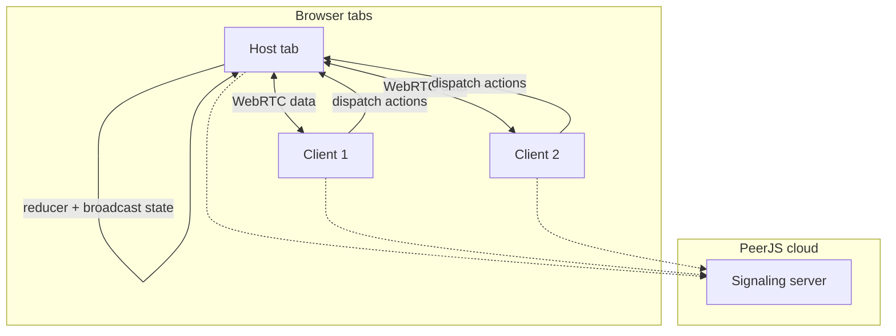

# Beat Roulette

A browser-based music party game with three modes: **Party** (guess whose song is playing), **Blitz** (fast chart-trivia matchmaking), and **Stage** (solo karaoke with real-time pitch scoring). No install required for players—open the site, pick a mode, and play from phones or laptops.

**Live site:** [beatroulette.app](https://beatroulette.app) (GitHub Pages)

---

## Table of contents

- [Overview](#overview)
- [Game modes](#game-modes)
- [How it works (architecture)](#how-it-works-architecture)
- [Project structure](#project-structure)
- [Requirements](#requirements)
- [Quick start (local development)](#quick-start-local-development)
- [Spotify setup (Party Mode, optional)](#spotify-setup-party-mode-optional)
- [Deployment](#deployment)
- [Scoring & rules reference](#scoring--rules-reference)
- [External services & APIs](#external-services--apis)
- [Browser & device notes](#browser--device-notes)
- [Troubleshooting](#troubleshooting)
- [License & credits](#license--credits)

---

## Overview

Beat Roulette is a **static single-page app**: React 18, Tailwind CSS, and Babel run entirely in the browser via CDN scripts. Multiplayer sync uses **PeerJS** (WebRTC data channels) with a **host-authoritative** game state—there is no custom game backend.

| Mode   | Players      | Network        | Music source                          |
|--------|--------------|----------------|---------------------------------------|
| Party  | 2+ (room code) | PeerJS P2P   | Deezer previews (+ optional Spotify import) |
| Blitz  | 2–5 (public lobby) | PeerJS P2P | Deezer global chart                   |
| Stage  | 1 (solo)     | None           | Deezer previews + synced lyrics       |

The UI uses a cinematic dark theme (gold / magenta / neon green accents), mobile-first layout, and optional desktop two-column layouts on wider screens.

---

## Game modes

### Party Mode (multi-device)

**Tagline:** *Your phone, your turn.*

1. **Host** opens a room, chooses how many songs each player adds (1–5 rounds per player), and shares a **5-letter room code** (or invite link with `?room=CODE`).
2. **Guests** join from their own devices with the code and display name.
3. In the **lobby**, everyone adds songs via Deezer search (30s preview when available). Hosts can optionally connect **Spotify** to bulk-import top tracks (previews resolved via Deezer).
4. When the song pool is ready, the host starts the game.
5. Each **round**:
   - A short preview plays (album art spins on a timer).
   - Players guess **which player** added the song (lock-in before reveal).
   - When everyone has voted, results show the owner, points, streaks, and badges (fastest correct, “sneaky” owner bonus).
6. After all rounds, a **final leaderboard** is shown.

**Join via URL:** `https://beatroulette.app/?room=ABCDE` pre-fills the join flow.

**Legacy pool rules:** If the host does not set “songs per player,” the game requires at least **3 songs** from **2 different owners** before starting.

---

### Blitz Mode (public matchmaking)

**Tagline:** *Find a match.*

1. Pick game length: **Short** (3 rounds), **Medium** (5), or **Long** (7).
2. Enter your name and tap **Find Match**.
3. The app joins or creates a **public room** for that length (`blitz-short`, `blitz-medium`, `blitz-long`).
4. **Lobby:** 2–5 players; once two are in, a **30s join window** opens for others. Everyone must **vote to start** after chart tracks are loaded.
5. Each **round** (30 seconds):
   - A Deezer chart preview plays.
   - Pick the correct track from **four choices**.
   - Points scale with speed (100–1000 for a correct answer).
6. **Results** after each round; **final** screen with replay vote to run again.

Matchmaking uses PeerJS: first client tries to join an existing room peer; if none exists, it becomes coordinator (host) and loads chart data from Deezer.

---

### Stage Mode (solo karaoke)

**Tagline:** *Pick a song · sing the preview · get a pitch score.*

1. **Search** for a track on Deezer.
2. **Ready** screen: lyrics load from [LRCLIB](https://lrclib.net) when available; grant **microphone** access.
3. **Performance:** 30s preview plays; synced lyrics highlight; **pitchy** analyzes your voice vs. reference pitch.
4. **Results:** score 0–100 and a label (e.g. “PITCH PERFECT”, “SHOWER SINGER”).

Headphones are recommended so speaker bleed does not confuse the mic.

---

## How it works (architecture)



- **`network.jsx`** defines canonical reducers (`reducer` for Party, `blitzReducer` for Blitz) and hooks (`useSession`, `useBlitzSession`).
- Only the **host / coordinator** applies actions and pushes full state to peers.
- **Clients** send `{ type: "action", action: { ... } }` messages; they never mutate shared state locally except when receiving `{ type: "state", state }`.
- Device IDs are per-tab (`sessionStorage` for Party host stability; fresh IDs for clients to avoid same-machine collisions).

Stage Mode keeps state in **`app.jsx`** only (`stageReducer`) and does not use PeerJS.

---

## Project structure

```
Beat_Roulette/
├── index.html          # Entry HTML, global CSS, CDN scripts, module loader for pitchy
├── app.jsx             # React UI: home, Party, Blitz, Stage (~5k lines)
├── network.jsx         # PeerJS sessions, reducers, Deezer chart fetch for Blitz
├── auth.jsx            # Spotify Authorization Code + PKCE (no backend)
├── stage-mode.jsx      # Reference only — not loaded by index.html
├── package.json        # Optional: pitchy dependency for local tooling
├── CNAME               # Custom domain: beatroulette.app
└── favicon*.png / apple-touch-icon.png
```

**Load order** (see `index.html`):

1. React, ReactDOM, Babel, Tailwind, PeerJS (CDN)
2. `pitchy` (ESM from jsDelivr → `window.PitchDetector`)
3. `network.jsx` → `auth.jsx` → `app.jsx` (Babel transpiled in browser)

There is **no bundler** in the default workflow—edit files and refresh.

---

## Requirements

- A modern browser with **WebRTC** (Chrome, Firefox, Safari, Edge).
- **HTTPS** (or `localhost`) for microphone access in Stage Mode and reliable media APIs.
- Network access to PeerJS signaling, Deezer, LRCLIB, and CDNs (see [External services](#external-services--apis)).

Optional:

- **Node.js** only if you run `npm install` (e.g. for editor types or local `pitchy`); the app runs without a Node build step.

---

## Quick start (local development)

1. **Clone the repository**

   ```bash
   git clone https://github.com/sohumvajaria/Beat_Roulette.git
   cd Beat_Roulette
   ```

2. **(Optional) Install dependencies**

   ```bash
   npm install
   ```

   The live app loads `pitchy` from CDN; `npm install` is not required to serve the game.

3. **Serve static files** (required—`file://` will break modules and APIs)

   ```bash
   # Python 3
   python3 -m http.server 8080

   # or npx
   npx --yes serve -p 8080
   ```

4. Open **http://localhost:8080** (or the port shown).

5. For **Party / Blitz** multiplayer on one machine, use **separate browser profiles or devices**—two tabs on the same machine can conflict if they share Peer IDs; the codebase mitigates this for host vs. client but real devices are best for testing.

---

## Spotify setup (Party Mode, optional)

Spotify is used only to **import your top tracks** into the lobby. Playback still uses Deezer 30s previews when found.

1. Create an app in the [Spotify Developer Dashboard](https://developer.spotify.com/dashboard).
2. Add a **Redirect URI** that matches your deployment, e.g.:
   - Production: `https://sohumvajaria.github.io/Beat_Roulette/` (as in `auth.jsx`)
   - Local: add `http://localhost:8080/` if you test OAuth locally
3. Open **`auth.jsx`** and set:

   ```javascript
   const SPOTIFY_CLIENT_ID = "your_client_id_here";
   ```

4. Adjust `SPOTIFY_REDIRECT_URI` if your hosted URL differs.

Scopes used: `user-top-read`, `user-read-recently-played`. Tokens are stored in **sessionStorage** (PKCE, no client secret in the browser).

---

## Deployment

The project is designed for **GitHub Pages** (or any static host):

1. Push the repo; enable Pages from the `main` branch (root).
2. For a custom domain, set **`CNAME`** to your domain (e.g. `beatroulette.app`) and configure DNS at your registrar.

No build step is required—publish `index.html`, `app.jsx`, `network.jsx`, `auth.jsx`, and assets as-is.

**After deploying Spotify OAuth**, update `SPOTIFY_REDIRECT_URI` and the Spotify Dashboard redirect list to your production URL.

---

## Scoring & rules reference

### Party Mode

| Event | Points |
|--------|--------|
| Correct guess | +1 |
| Fastest correct guess (among correct guessers) | +1 bonus |
| Correct guess with streak ≥ 3 | +1 bonus |
| Song owner: more than half of **locked-in** guessers wrong | +1 (“sneaky”) |
| Wrong guess or no lock-in | 0 (streak resets for guessers) |

Rounds advance: `splash` → `round` → `results` → next round or `final`.

### Blitz Mode

| Event | Points |
|--------|--------|
| Correct answer | `100`–`1000` based on elapsed time in the 30s window |
| Wrong answer | 0 |

Formula (simplified): faster answers earn more, minimum 100 for correct.

### Stage Mode

- Score **0–100** from voiced ratio, pitch accuracy vs. reference, and match quality.
- Labels include: PITCH PERFECT (100), STAGE READY (80–99), FEELING IT (60–79), SHOWER SINGER (40–59), etc.

---

## External services & APIs

| Service | Used for |
|---------|----------|
| **PeerJS** | WebRTC signaling + data channels (default public signaling server) |
| **Deezer API** | Track search, 30s previews, chart tracks (Blitz), album art |
| **LRCLIB** | Synced/plain lyrics (Stage Mode) |
| **Spotify Web API** | Top tracks import (Party, optional) |
| **pitchy** | Real-time pitch detection (Stage Mode) |
| **CORS proxies** | `corsproxy.io`, `api.allorigins.win` — fallback when direct `fetch` to Deezer/LRCLIB is blocked |
| **jsDelivr / unpkg** | React, Babel, Tailwind, PeerJS, Twemoji assets |

The app does not send game state to a proprietary backend; only the above third parties are contacted from the client.

---

## Browser & device notes

- **Autoplay:** Preview audio may require a user gesture on some browsers; in-game controls call `play()` after interaction.
- **iOS Safari:** WebRTC and autoplay policies are stricter—test Party/Blitz on real devices.
- **Stage Mode:** Requires microphone permission; use HTTPS.
- **Same Wi‑Fi / NAT:** PeerJS usually works; corporate firewalls blocking WebRTC may prevent multiplayer.
- **Reduced motion:** Homepage mode cards respect `prefers-reduced-motion`.

---

## Troubleshooting

| Problem | Things to try |
|---------|----------------|
| “Room not found” | Check the code; host must keep the hosting tab open; try a new code. |
| “Room code already in use” | Another session is using that Peer ID; host with a different code. |
| Blitz “Matchmaking failed” | Retry; check network; another player may have filled the room. |
| No preview / “Preview unavailable” | Deezer may lack a preview for that track; pick another song or guess from title/artist. |
| Spotify login fails | Verify `SPOTIFY_CLIENT_ID` and redirect URI exactly match the Dashboard. |
| Stage score always 0 | Allow mic; use headphones; sing louder/closer; check browser mic input. |
| Party/Blitz on two tabs same PC | Prefer two browsers or phones; client tabs use fresh device IDs by design. |

---

## License & credits

- Application code: see repository license (if present) or contact maintainers.
- **pitchy** — MIT ([aubio/pitchy](https://www.npmjs.com/package/pitchy))
- **PeerJS** — MIT
- Music metadata/previews via **Deezer**; lyrics via **LRCLIB**; optional **Spotify** integration per their terms of use.

---

## Contributing

1. Fork and branch from `main`.
2. Test all three modes locally over `http://localhost` with real devices when changing `network.jsx` or audio behavior.
3. Keep changes minimal in `app.jsx` (large file)—prefer focused edits.
4. If you change Spotify redirect URLs, document them in `auth.jsx` and this README.

Questions or bugs: open an issue on the GitHub repository.
